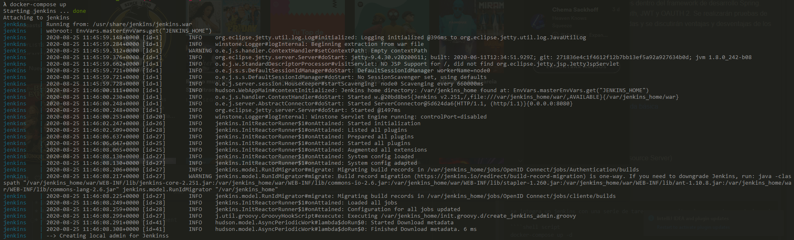
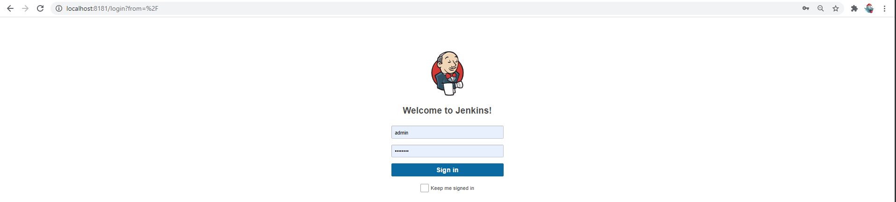
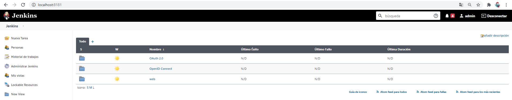

# Spring-Security 
[](https://github.com/MCYP-UniversidadReyJuanCarlos/19-20_ansoce/actions)


* **Project title** : Comparativa de métodos de autenticación y autorización en aplicaciones Spring
* **Project description** :El alumno implementará y comparará diferentes técnicas de autenticación y autorización disponibles dentro del framework de desarrollo Spring. Concretamente se analizarán Basic Auth, JWT y OAUTH 2. Se realizarán pruebas de seguridad de las técnicas implementadas y se discutirán ventajas y desventajas de los tres en base a diferentes criterios. 
* Features :
  * Web
    * context
    * config  
    * ejemplos
      * [Aplicacion Web básica](web/web-basic)
      * [Aplicacion Web Securizada básica](web/web-basic-security)
      * [users in file](web/web-security-custom-I)
      * [users in DDBB](web/web-security-db)
      * [users in DDBB noSQL](web/web-security-db-nosql)
      * [users in ldap](web/web-security-ldap)
  * OAUTH (Spring OAUH Client, Resource Server)
      * [OAuth 2 Client Credentials Flow](oauth2/clientcredentials)
      * [OAuth 2 Owner Password Flow](oauth2/ownerpassword)
      * [OAuth 2 Authorization Code Flow](oauth2/authorizationcode)
      * [OAuth 2 Implicit Flow](oauth2/implicit)
  * OpenID
      * [OIDC Autenthicate](openid/authenticate)
      * [OIDC Autenthicate & resource server](openid/cliente)
* How to run

```` 
se integra un jenkins con una serie de tareas que permiten lanzar cada uno de los ejemplos de forma sencilla. Para arrancar el jenkins se ejecuta en la raíz del proyecto:

````shell script
docker-compose up -d
````
y para parar con
````shell script
docker-compose down
```` 

 
Se accede a la [consola de jenkins](http://localhost:8181)



El usuario de acceso es admin/adminpwd

