##Authorization Code Grant

El tipo de autorización de "code grant type" se utiliza para obtener tokens de acceso y tokens de refresco, está optimizado para clientes confidenciales.
Dado que se trata de un flujo basado en redirecciones, el cliente debe ser capaz de interactuar con el usuario-agente propietario del recurso (normalmente una web navegador) y capaz de recibir solicitudes entrantes (mediante redirección) desde el servidor de autorización. 
[Referencia](https://tools.ietf.org/html/rfc6749#section-4.1)
     +----------+
     | Resource |
     |   Owner  |
     |          |
     +----------+
          ^
          |
         (B)
     +----|-----+          Client Identifier      +---------------+
     |         -+----(A)-- & Redirection URI ---->|               |
     |  User-   |                                 | Authorization |
     |  Agent  -+----(B)-- User authenticates --->|     Server    |
     |          |                                 |               |
     |         -+----(C)-- Authorization Code ---<|               |
     +-|----|---+                                 +---------------+
       |    |                                         ^      v
      (A)  (C)                                        |      |
       |    |                                         |      |
       ^    v                                         |      |
     +---------+                                      |      |
     |         |>---(D)-- Authorization Code ---------'      |
     |  Client |          & Redirection URI                  |
     |         |                                             |
     |         |<---(E)----- Access Token -------------------'
     +---------+       (w/ Optional Refresh Token)

 
   (A) El cliente (aplicación) solicita el consentimiento expreso para acceder al usuario. El cliente incluye su identificador de cliente, alcance solicitado, estado local y un URI de redireccionamiento al que el servidor de autorización enviará de vuelta al navegador del usuario una vez que se conceda (o deniegue el acceso). 

   (B) El servidor de autorización autentica al propietario del recurso (a través del navegador) y establece si el propietario del recurso otorga o deniega la solicitud de acceso del cliente.

   (C) Suponiendo que el propietario del recurso otorga acceso, el servidor de autorización redirige al navegador de regreso al cliente utilizando el URI de redirección proporcionado anteriormente (en la solicitud o durante el registro del cliente). El URI de redirección incluye un código de autorización y cualquier estado local proporcionado anteriormente por el cliente. 

   (D) El cliente solicita un token de acceso desde el punto final del token del servidor de autorización al incluir el código de autorización recibido en el paso anterior. Al realizar la solicitud, el cliente se autentica con el servidor de autorización. El cliente incluye el URI de redireccionamiento utilizado para obtener el código de autorización para la verificación. 

   (E) El servidor de autorización autentica al cliente, valida el código de autorización y asegura que el URI de redirección recibido coincide con el URI utilizado para redirigir al cliente en el paso (C). Si es válido, el servidor de autorización responde con un token de acceso y, opcionalmente, un token de actualización.
 
 
 #Flujo desde navegador
 Se accede a http://127.0.0.1:9090
 
 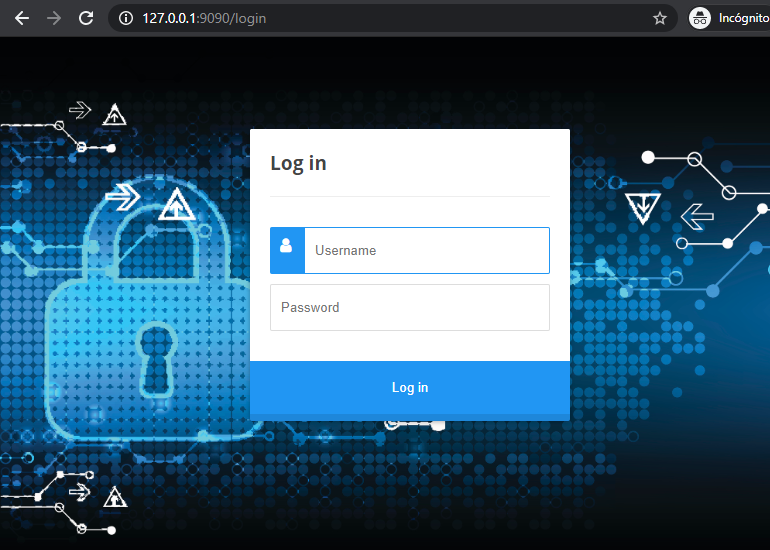
 
 Se loga en la aplicación con user/password
 
 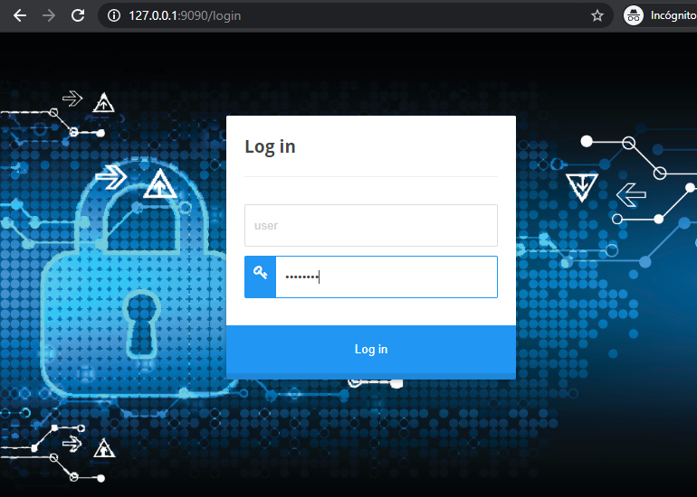
 
 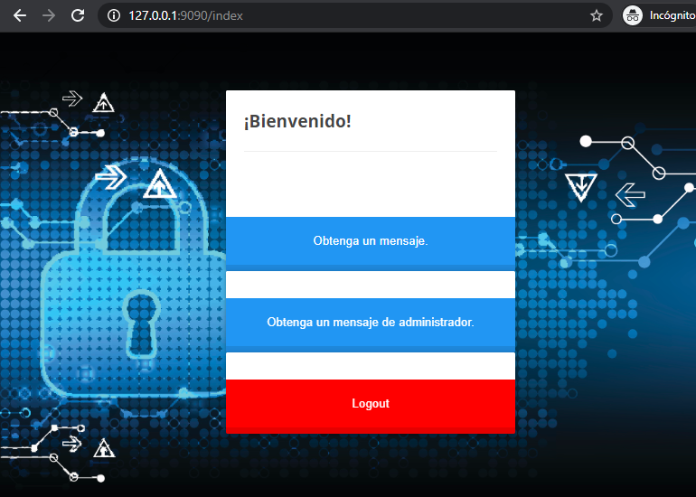
 
 Se solicita un mensaje el cual requiere permisos de user que la aplicación si tiene, se redirige el navegador al servidor de autenticación para que el cliente se loge directamente en el servidor de autorización.
 
 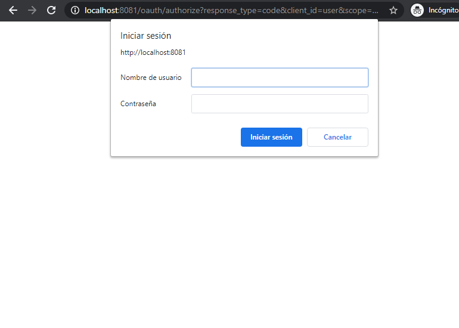
 
 En este caso las credenciales son alumno@urjc.es/password.
  
 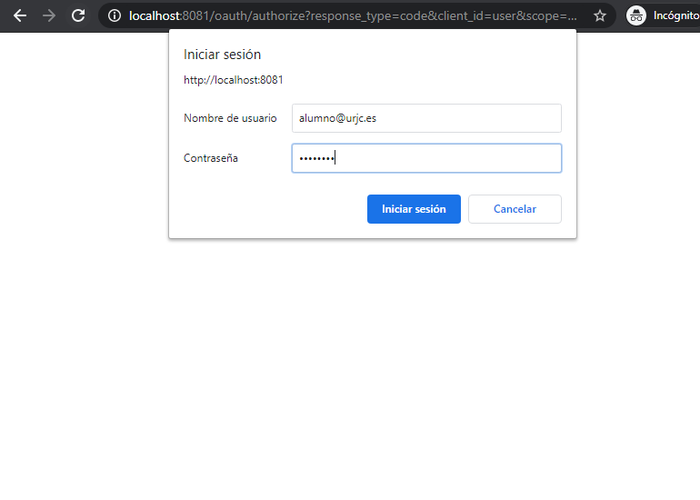
 
 El servidor de autorizacion solicita confirmación de si se quiere dar permiso o denegar, en este caso se acepta.
 
 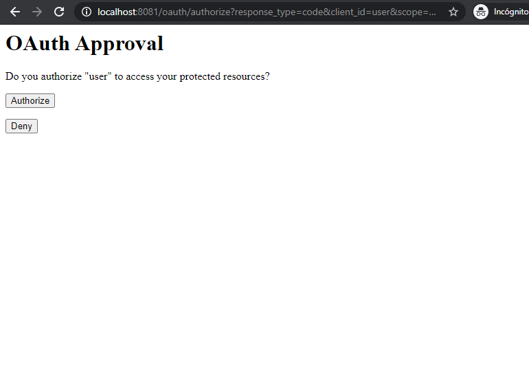
 
 Se obtine del servidor de recursos el mensaje
  
 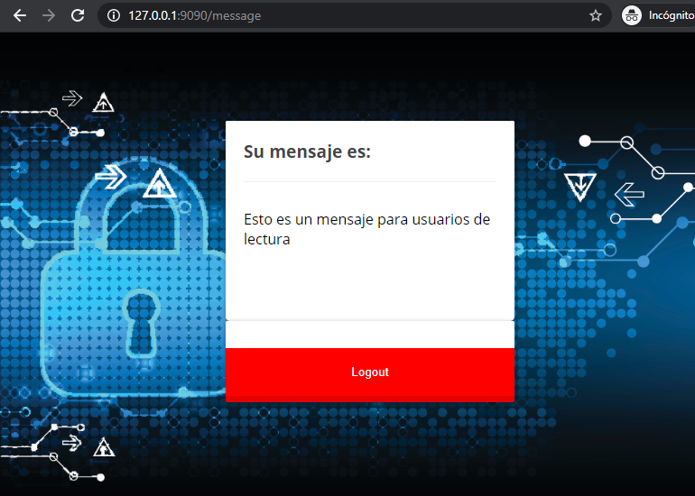
 
 En el caso que se solicite el mensaje de administrador
 
 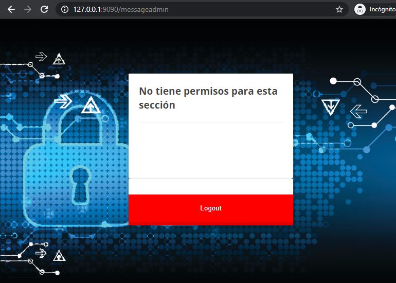
 
 #Capturas de tráfico con wireshark de una solicitud correcta
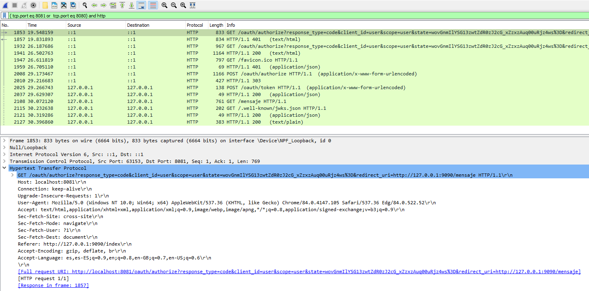

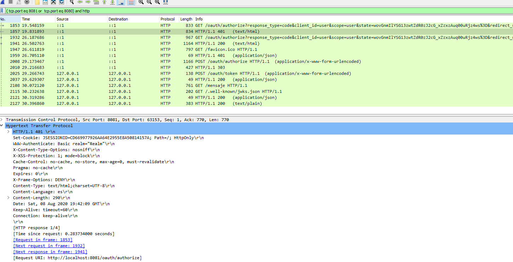

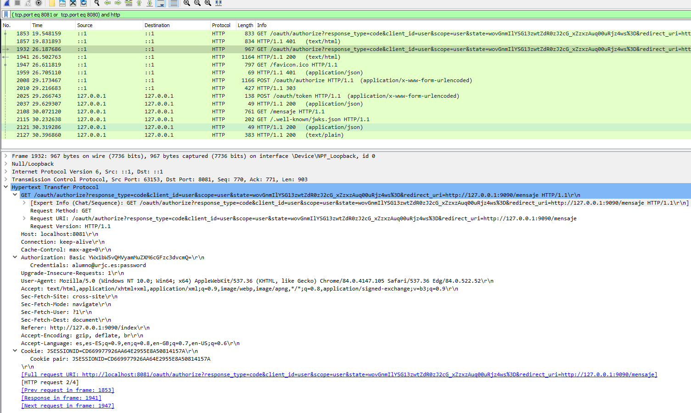

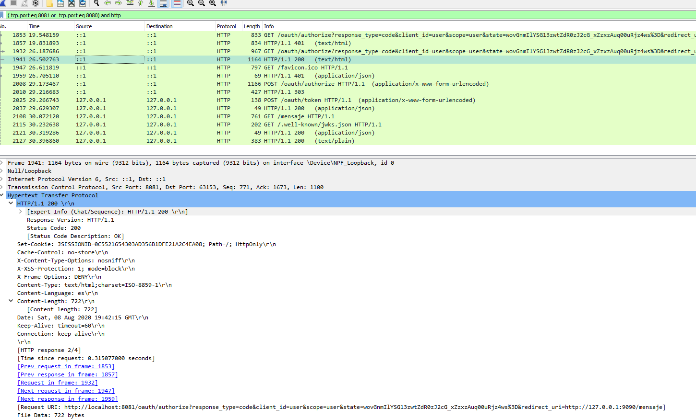

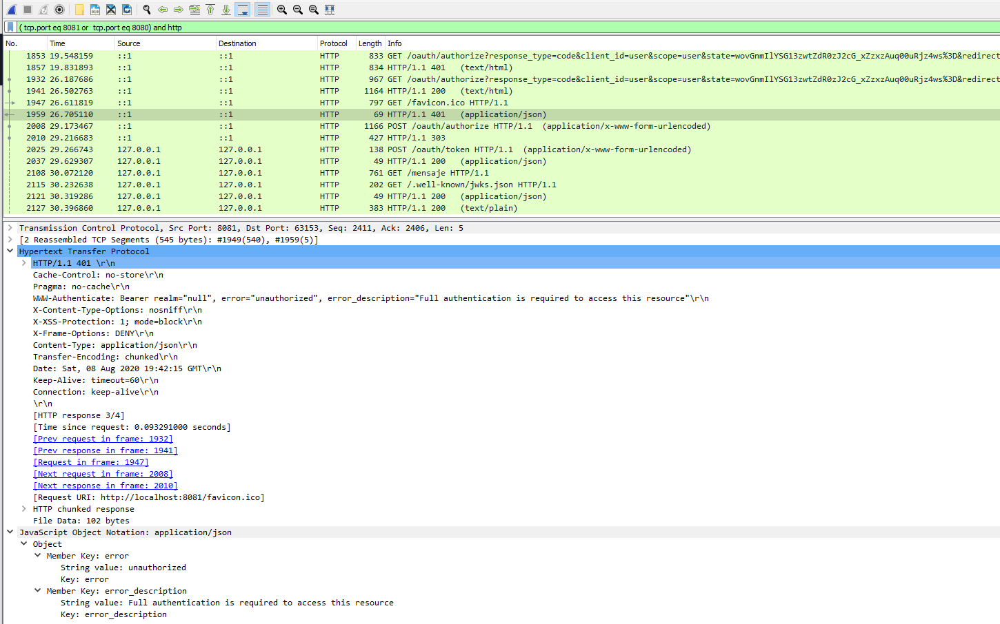

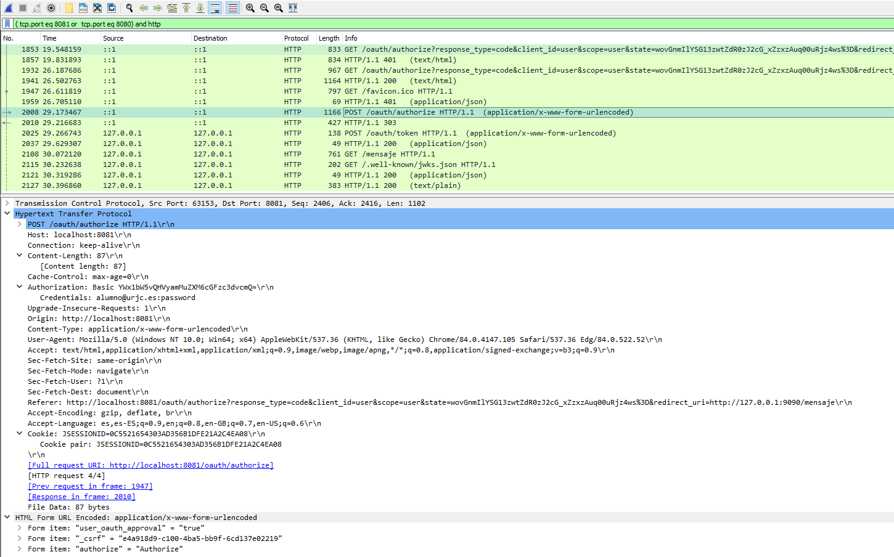

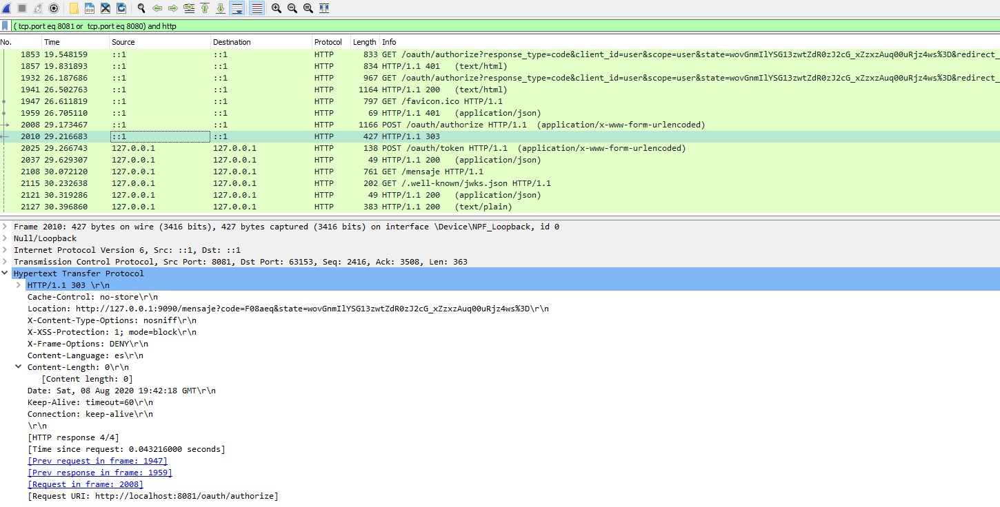

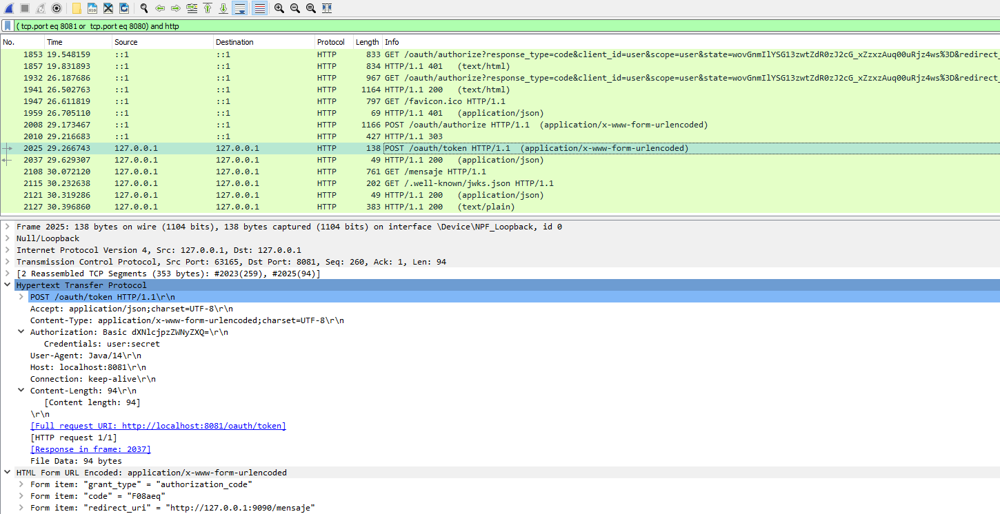

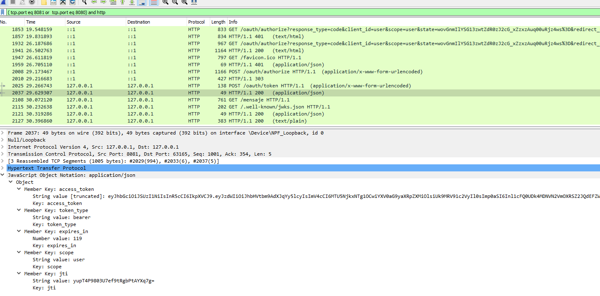

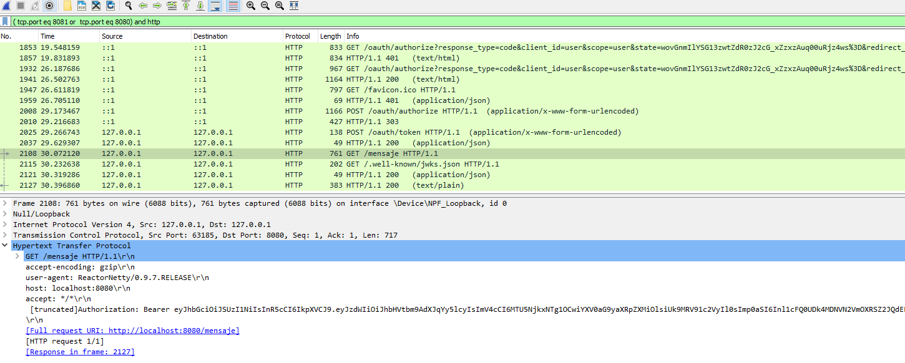

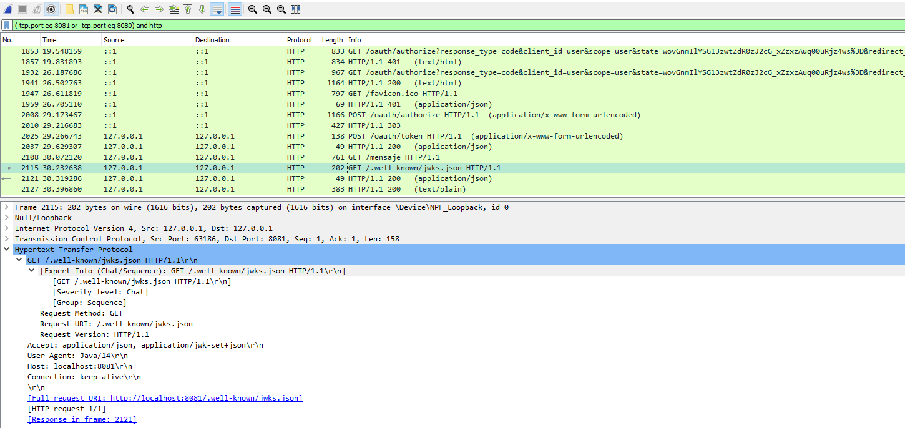

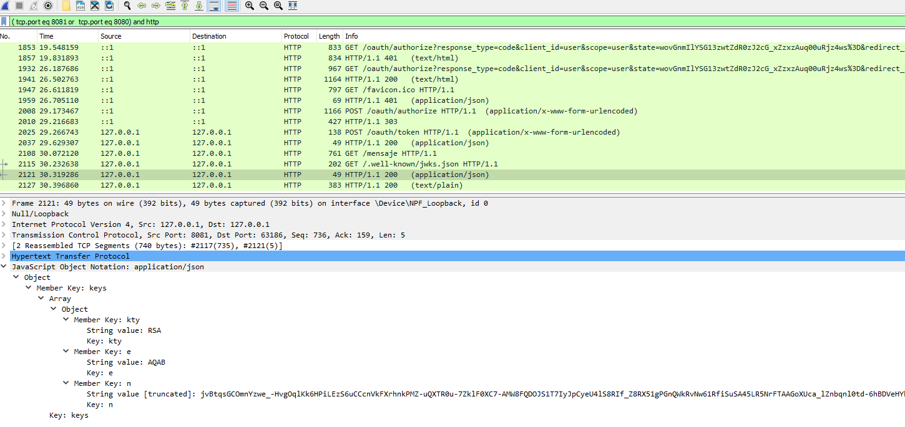

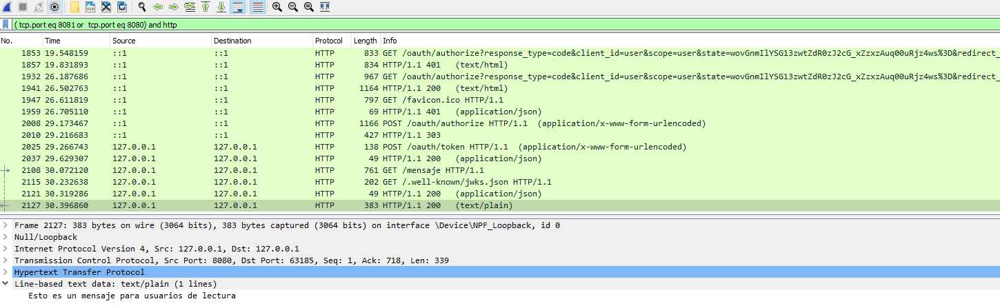