##Client Credentials Grant


El "client credentials grant type" **DEBE** ser utilizado únicamente por clientes confidenciales. 
[Referencia](https://tools.ietf.org/html/rfc6749#section-4.4)
       +---------+                                  +---------------+
       |         |                                  |               |
       |         |>--(A)- Client Authentication --->| Authorization |
       | Client  |                                  |     Server    |
       |         |<--(B)---- Access Token ---------<|               |
       |         |                                  |               |
       +---------+                                  +---------------+
 
 - (A) El cliente se autentica con el servidor de autorización y solicita un token de acceso desde el punto final del token. 
 - (B) El servidor de autorización autentica al cliente y, si es válido, emite un token de acceso.
 
 
 
 #Flujo:
 - Se crea un servidor de autorización ()
 - Se crea un servidor de recursos ()
 - Como aplicación cliente se usa un postman () 
    Curl de autenticación contra el authentication server:
    ````
   curl --location --request POST 'http://localhost:8081/oauth/token' \
   --header 'Authorization: Basic dXNlcjpzZWNyZXQ=' \
   --header 'Content-Type: application/x-www-form-urlencoded' \
   --header 'Cookie: JSESSIONID=F7BA6F29AD0E546AAE2EC6EE1C80FF45' \
   --data-urlencode 'grant_type=client_credentials' \
   --data-urlencode 'scope=user'
   ````
   
   Curl de llamada al servidor de recursos:
   requiere scope de user
   ````
   curl --location --request GET 'http://localhost:8080/mensaje' \
   --header 'Authorization: bearer {Token}'
   ````
   requiere scope de admin
   ````
   curl --location --request GET 'http://localhost:8080/administrador' \
   --header 'Authorization: bearer {Token}'
   ````

#Flujo desde navegador
Se accede a http://127.0.0.1:9090

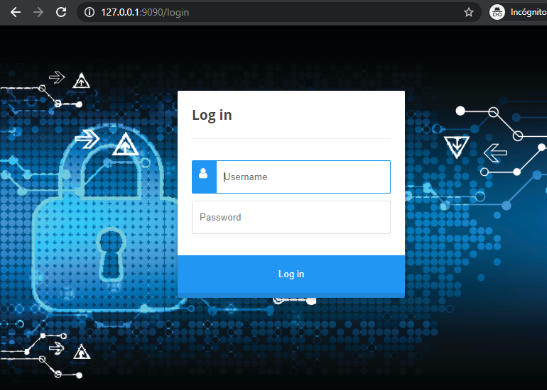

Se loga en la aplicación con user/password

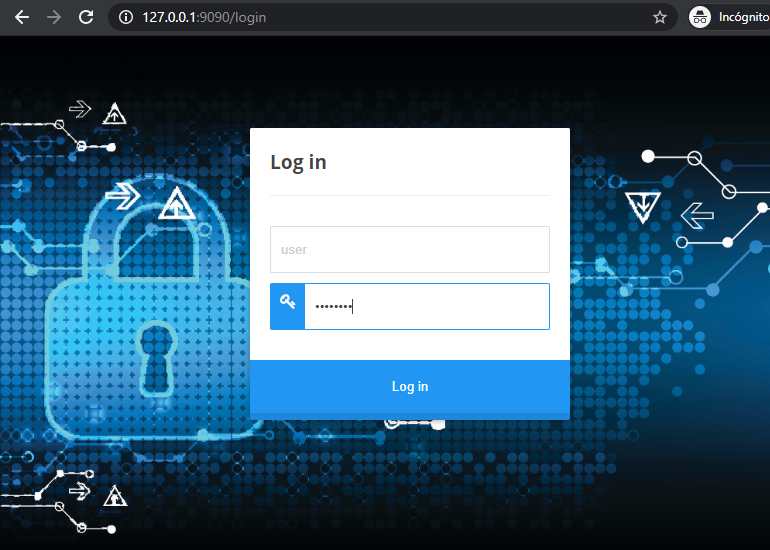

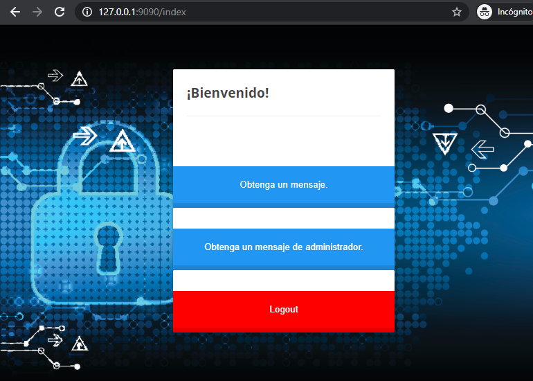

Se solicita un mensaje el cual requiere permisos de user que la aplicación si tiene

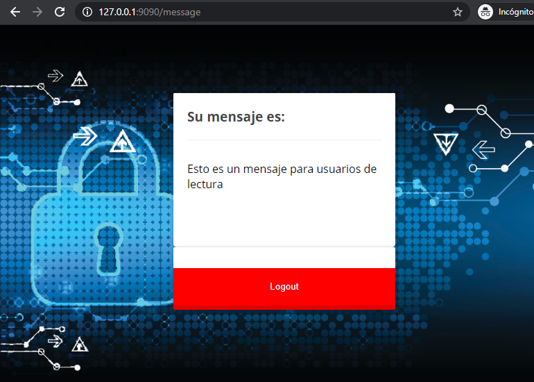

Se solicita un mensaje de administrador que requiere permisos de admin que la aplicación no tiene

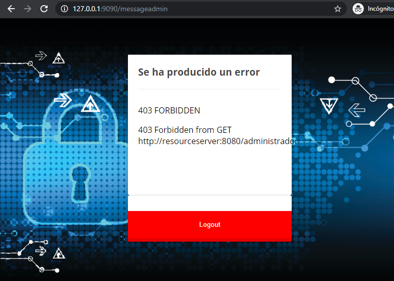

#Capturas de tráfico con wireshark de una solicitud correcta
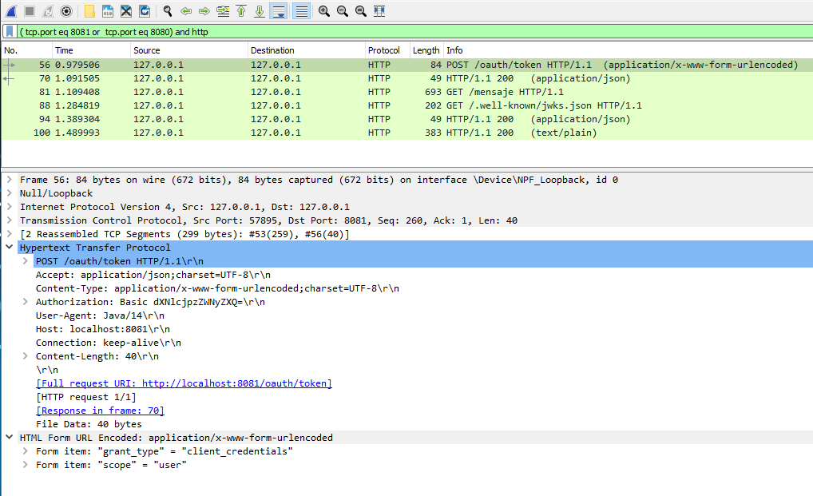
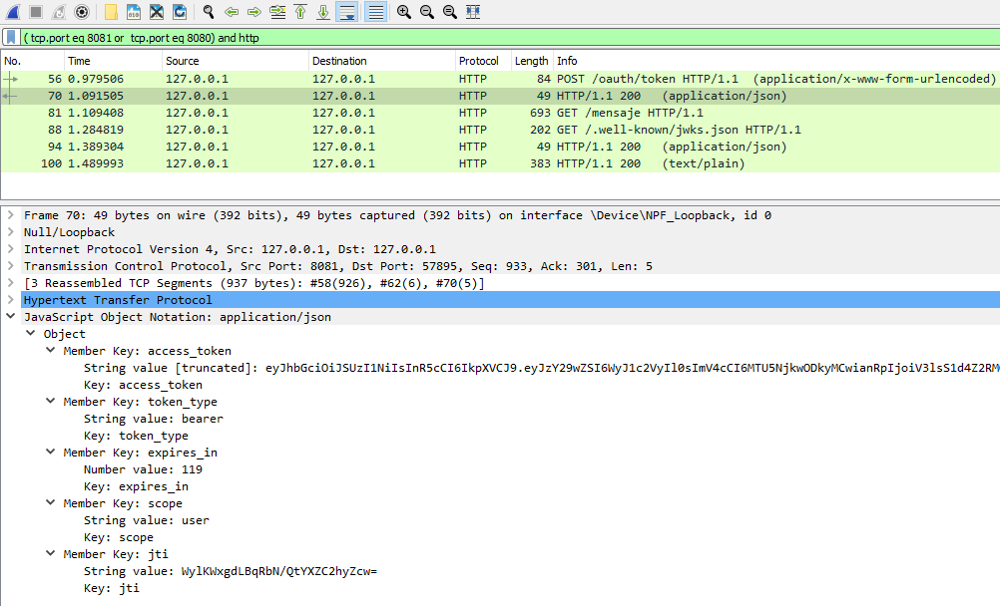
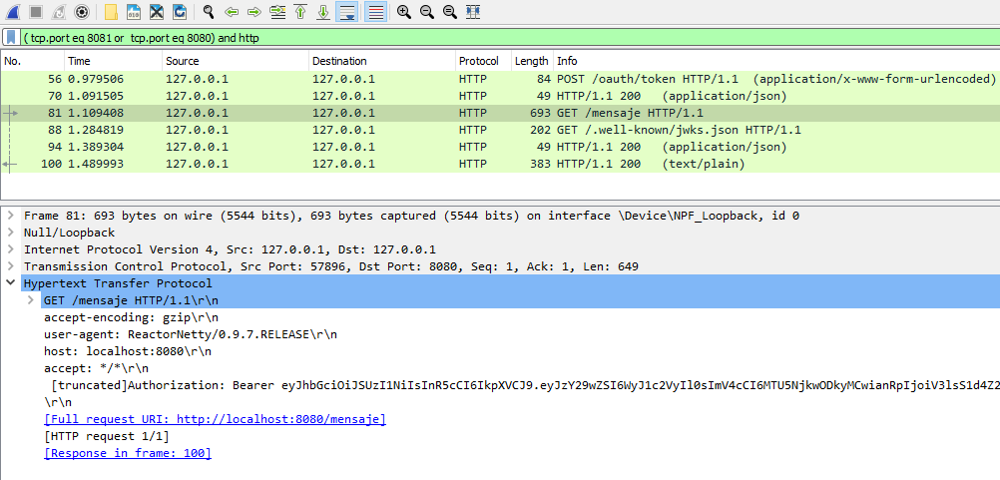
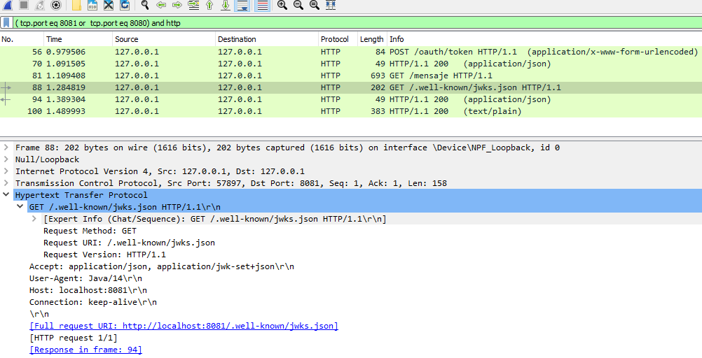
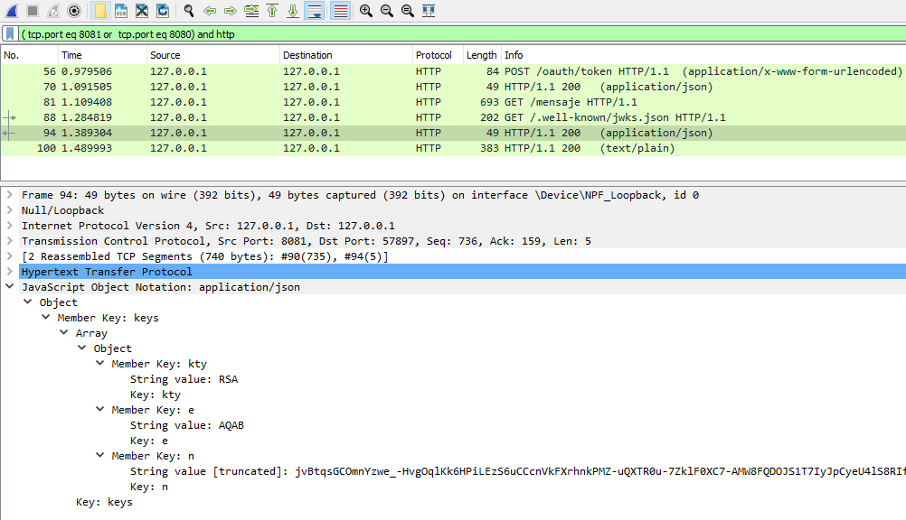
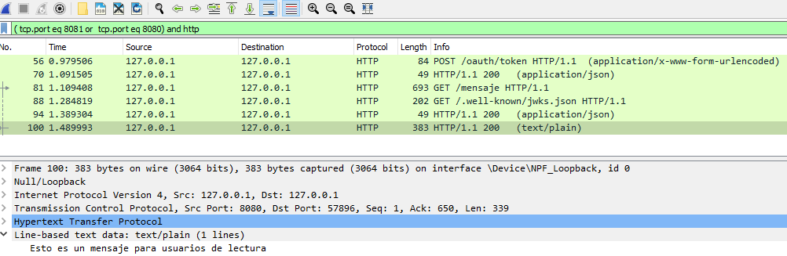
