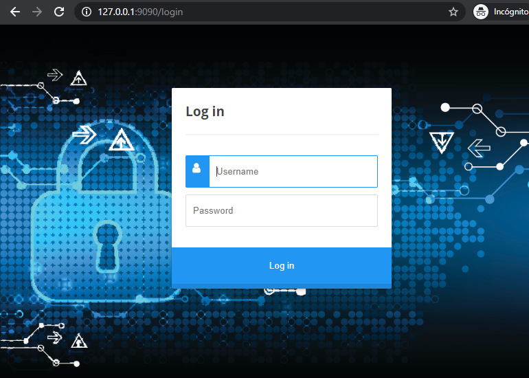

## Resource Owner Password Credentials Grant

En "Resource Owner Password Credentials Grant" el usuario debe de intervenir proporcionando su usuario y contraseña no al servidor de autorización si no a la aplicación cliente.
Esta situación implica que los dueños del recurso deben confiar plenamente en la aplicación para introducir sus credenciales.
[Referencia](https://tools.ietf.org/html/rfc6749#section-4.3)

     +----------+
     | Resource |
     |  Owner   |
     |          |
     +----------+
          v
          |    Resource Owner
         (A) Password Credentials
          |
          v
     +---------+                                  +---------------+
     |         |>--(B)---- Resource Owner ------->|               |
     |         |         Password Credentials     | Authorization |
     | Client  |                                  |     Server    |
     |         |<--(C)---- Access Token ---------<|               |
     |         |    (w/ Optional Refresh Token)   |               |
     +---------+                                  +---------------+
 
 - **(A)** El propietario del recurso proporciona al cliente su nombre de usuario y contraseña. 

 - **(B)** El cliente solicita un token de acceso desde el punto final del token del servidor de autorización al incluir las credenciales recibidas del propietario del recurso. Al realizar la solicitud, el cliente se autentica con el servidor de autorización. 

 - **(C)** El servidor de autorización autentica al cliente y valida las credenciales del propietario del recurso y, si es válido, emite un token de acceso
 
  
# Modificaciones
Se modifica la configuración del proveedor de autorización para que use el flujo de Client Credential:
**authorization-grant-type: password** 
 
 ````
spring:
  thymeleaf:
    cache: false
  security:
    oauth2:
      client:
        registration:
          custom-client:
            provider: custom-provider
            client-id: user
            client-secret: secret
            authorization-grant-type: password
            scope: user
        provider:
          custom-provider:
            token-uri: http://authorizationserver:8081/oauth/token
            authorization-uri: http://authorizationserver:8081/oauth/authorize
messages:
  base-uri: http://resourceserver:8080/
 ````

Adicionalmente se requiere recoger del formulario las credenciales informadas para enviárselas al proveedor de autorización, para eso se añade al webclient:

````java
	private Function<OAuth2AuthorizeRequest, Map<String, Object>> contextAttributesMapper() {
		return (authorizeRequest) -> {
			Map<String, Object> contextAttributes = Collections.emptyMap();
			HttpServletRequest servletRequest = authorizeRequest.getAttribute(HttpServletRequest.class.getName());
			String username = servletRequest.getParameter(OAuth2ParameterNames.USERNAME);
			String password = servletRequest.getParameter(OAuth2ParameterNames.PASSWORD);
			if (StringUtils.hasText(username) && StringUtils.hasText(password)) {
				contextAttributes = new HashMap<>();

				// `PasswordOAuth2AuthorizedClientProvider` requires both attributes
				contextAttributes.put(OAuth2AuthorizationContext.USERNAME_ATTRIBUTE_NAME, username);
				contextAttributes.put(OAuth2AuthorizationContext.PASSWORD_ATTRIBUTE_NAME, password);
			}
			return contextAttributes;
		};
````
y se añade como configuración

````java
		// For the `password` grant, the `username` and `password` are supplied via
		// request parameters,
		// so map it to `OAuth2AuthorizationContext.getAttributes()`.
		authorizedClientManager.setContextAttributesMapper(contextAttributesMapper());
````  
Video de Ejecución : [Video](./doc/EjemploOP.mp4)
 
# Flujo desde navegador
Se accede a http://127.0.0.1:9090



Se loga en la aplicación con user/password


Se rellenan las credenciales de usuario para solicitar el mensaje al servidor de recursos


Se Obtiene el mensaje solicitado


# Capturas de tráfico con wireshark de una solicitud correcta


