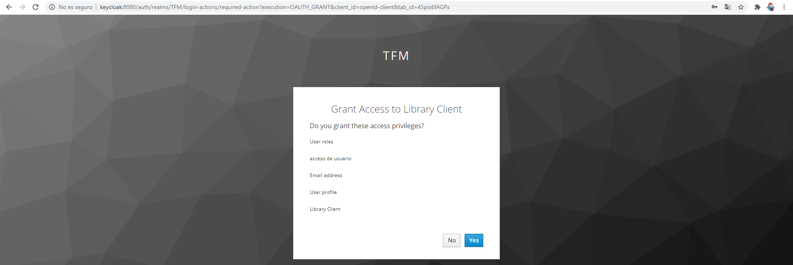
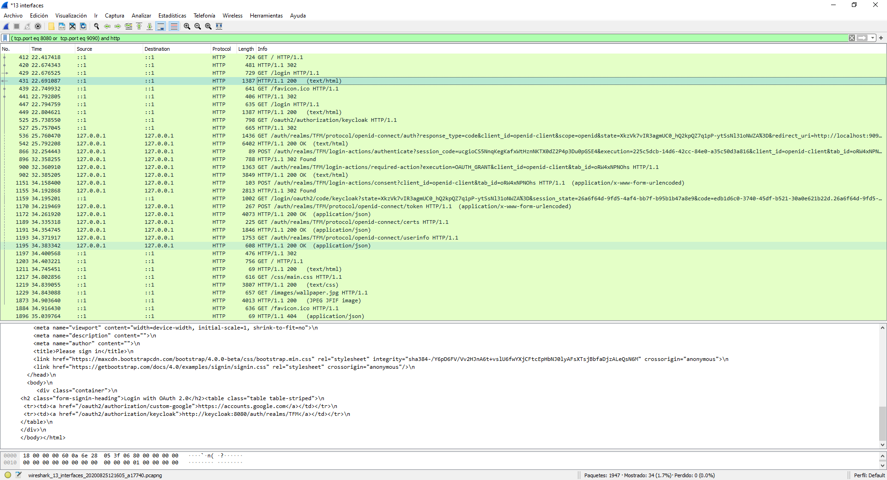

## OIDC FLOW

 

 # Requisitos
 Para que funcione correctamente el IP Keycloak es necesario modificar el host para que resuelva el dominio keycloak a 127.0.0.1
 desde dentro de los contenedores se puede resolver el dominio pero para las redirecciones es necesario modificar el host para que resuelva.
 ´5
 # Flujo desde navegador
 Se accede a http://localhost:9090
 
 
 
 Se presentan los distintos Identity Providers configurados.
 
 
 Se selecciona para el ejemplo Keycloak que se inicia con el mismo job.
 
 
 
 Se usa el usuario arturo/secret configurado en Keycloak
 
 
 
 Se muestran los datos recuperados.
  
 
 
 # Capturas de tráfico con wireshark de una solicitud correcta
 

