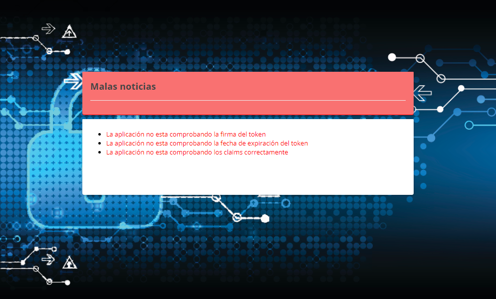

## Herramienta de test

Como se ha podido ver con los distintos ejemplos Spring ofrece multitud de opciones para securizar las aplicaciones de multitud de formas, pero esa versatilidad y capacidad de configuración también puede conllevar a que se comentan errores, si bien las configuraciones por defecto que ofrece son robustas, en un caso real no suelen ser las que se usan ya que siempre se requiere alguna modificación, bien para adaptar un modelo de datos de usuario, la granularidad de los permisos, etc.
Es en estas personalizaciones donde se pueden cometer errores, ya que es posible creer que Spring va a configurar las cosas por nosotros, que si bien cuando todo es por defecto lo hace no tiene que ser así cuando se empiezan las modificaciones ya que se pueden eliminar importaciones, dependencias o que la configuración por defecto no aplique. Un ejemplo de esto podría ser un ecosistema en el que las maquinas no tienen bien sincronizadas los relojes y hay diferencia de varios minutos entre servidores, cuando el servidor de autorización emite un token valido por 1 minutos, cuando llega a una máquina que esta  minutos descompensada (es una exageración, pero es un supuesto), se puede decir dotar a servidores de una horquilla de 15 min para la validación de la fecha de expiración de los token, el token se emitirá con el mismo tiempo de expiración pero los servidores validaran este token con una horquilla de +-15 min. Al modificar el validador de los tokens con el nuevo validador de la fecha de expiración se pueden eliminar los de por defecto.
Este es el motivo por el que se decide implementar esta herramienta, para que de forma sencilla y con la mínima intrusión se puede realizar una validación de seguridad en el flujo de Autenticación y autorización.

# Funcionalidad
La aplicación de test proporciona la capacidad de verificar las validaciones que una aplicación Spring realiza sobre el token de autenticación idToken. 
Existen distintos vectores de ataque en el flujo de autenticación:

* Manipulación del token
* Robo de token para uso posteriores
* Uso de token de otros proveedores de identidad
* …

Por lo tanto, es imprescindible garantizar que las aplicaciones realizan una correcta validación de los tokens que les proporciona el proveedor de identidad, si bien es cierto que existe gran control y foco en los proveedores de identidad no hay que descuidar los consumidores. 
El funcionamiento de la aplicación consiste en generar diferentes tokens frente a un escenario de login, cada una de estos tokens manipula un aspecto, en concreto se realizan 3 tipos de manipulaciones:

* **Firma**: Se manipula la firma del token para que con la clave pública del proveedor de identidad no se pueda verificar. De esta forma se puede verificar que el token ha sido emitido por la entidad que se ha configurado en la aplicación.

* **Fecha de expiración**: se manipula la generación del token para indicar una fecha de creación y caducidad anterior al momento de creación. Con este token se valida que la aplicación cliente verifica la caducidad de los tokens por lo que un token que se robase no se podría utilizar indefinidamente si no hasta su fecha de expiración que no debería ser excesiva.

* **Claims**: Se manipula el claim Audience (https://tools.ietf.org/html/rfc7519#section-4.1.3). De tal forma que si la aplicación cliente acepta el token no está validando correctamente los claims como se indica en la especificación https://openid.net/specs/openid-connect-core-1_0.html#IDTokenValidation. Se ha manipulado solo uno de los claims pero se podría modificar mas de uno o hacerlo de forma selectiva generando más token y así poder detectar el claim en concreto que no se valida.

Con los tres tokens manipulados y uno correcto se ejecutan los login dentro de la aplicación cliente, si la aplicación cliente solo se loga con el login sin manipular se verifica que se están realizando las validaciones correctas, si se admite más de un token la aplicación presenta una vulnerabilidad que hay que corregir.

# Arquitectura
La Arquitectura empleada en esta herramienta y en el resto de ejemplos está basada en contenedores levantados mediante el orquestador Docker Compose. Para facilitar la ejecución se han integrado todos los ejemplos mediante Jenkins para de forma fácil poder ejecutar y evaluar los casos de uso.


* Jenkins: como lanzador de las aplicaciones y ejemplos.
* Docker Compose: Para orquestar la sincronización y ejecución de los distintos contenedores.
* Docker como motor de contenedores.
* Selenium: como motor para ejecutar los flujos de login en un navegador, permite grabar escenarios y reproducirlos, normalmente para la ejecución de test.
* KeyCloak como proveedor de identidad para OIDC, es un proveedor de identidad y acceso open source promovido por RedHat.
* Aplicación Cliente: Esta aplicación cliente es la aplicación que se va a evaluar, esta implementada con Spring y basada en el ejemplo de cliente de OIDC que se expuso en la sección anterior. Esta aplicación tiene la particularidad de ofrecer distintos niveles de seguridad configurables mediante flags:
    * Se deshabilita la verificación de la firma de los tokens
	* Se deshabilita la verificación de la fecha de expiración
	* Se deshabilita la verificación de los claims.
* Herramienta de Test: esta es la herramienta que se ha implementado, tiene una doble función:
    * Generación de los tokens: Genera los cuatro tokens, uno correcto y 3 manipulados como respuesta a la petición de intercambio del código por los tokens en un flujo de Authorization code.
    * Ejecuta los login dentro de la aplicación cliente, en concreto sincroniza la ejecución de 4 logins, cada uno de ellos con cada token generado. Evalúa la respuesta de la aplicación para verificar que tokens admite y cuales rechaza para presentar un reporte por pantalla.

# Ejemplo de Flujo
[video](./doc/Flujo.mp4)

Para ejecutar los tests sobre la aplicación por un lado es necesario configurar el servidor KeyCloak como IdP de la aplicación, en una configuración de SpringBoot basta con añadir la siguiente configuración sustituyendo la de la aplicación.

````
spring:
  security:
    oauth2:
      client:
        registration:
          keycloak:
            client-id: 'openid-client'
            client-secret: '2f97a220-82d6-417e-b14b-eb1b1c9f95cf'
            authorizationGrantType: authorization_code
            redirect-uri: '{baseUrl}/login/oauth2/code/{registrationId}'
            scope: openid
        provider:
          keycloak:
            issuer-uri: http://keycloak:8080/auth/realms/TFM
            token-uri: http://tool:8050/auth/realms/TFM/protocol/openid-connect/token
            user-name-attribute: name
````
Tras modificar la configuración y asegurando que la aplicación tiene conectividad tanto con el IdP como con la herramienta de test. Se ejecuta la propia herramienta, se muestra la siguiente pantalla:
 

Se rellenan los campos requeridos en este caso son en el primer campo la página de login de la aplicación a testear y en el segundo campo la URL de destino en el caso de que el login sea correcto.


Se pulsa en el botón verificar.  

En este punto el flujo es:
* **Herramienta de Test**: Configura el endpoint de obtención de token para devolver un token correcto. Y lanza la ejecución del test de Selenium que simula la acción de un login
* **Selenium**: Ejecuta un login.
* **Aplicación Cliente**: se ejecuta un login en la aplicación y se inicia un flujo de Authentication Code contra KeyCloak
* **KeyCloak**: valida las credenciales del usuario y genera el código y la redirección para completar el flujo de Authentication Code.
* **Aplicación Cliente**: con el código obtenido llama a la aplicación de test para intercambiar el código por los tokens.
* **Herramienta de Test**: retorna a la aplicación cliente el token que se había configurado en el primer paso.
* **Aplicación Cliente**: Finaliza el login de forma correcta o incorrecta tras validar el token
* **Herramienta de Test**: Evalúa el resultado del test ejecutado por Selenium, de tal forma que la aplicación sabe si con un token correcto ha funcionado correctamente el login. Se repite este flujo con los 3 token manipulado y se evalúan los resultados de tal forma que si el único token que ha logrado un login correcto es el token sin manipulación se obtiene el siguiente resultado:
 

Si por el contrario el test se lanza contra una aplicación que no realza ninguna validación y los 4 token obtienen un login correcto se obtiene el siguiente resultado:

 


Adicionalmente el cliente que se utiliza para probar la aplicación se ha configurado para que admita diferentes configuraciones de seguridad de forma que mediante tres flags se pueda configurar que validaciones hace la aplicación. Para facilitar la ejecución se ha integrado este flujo en un job de Jenkins:
 


Ejemplo de ejecución : [Video](./doc/Tool.mp4)