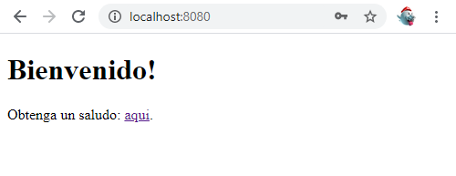
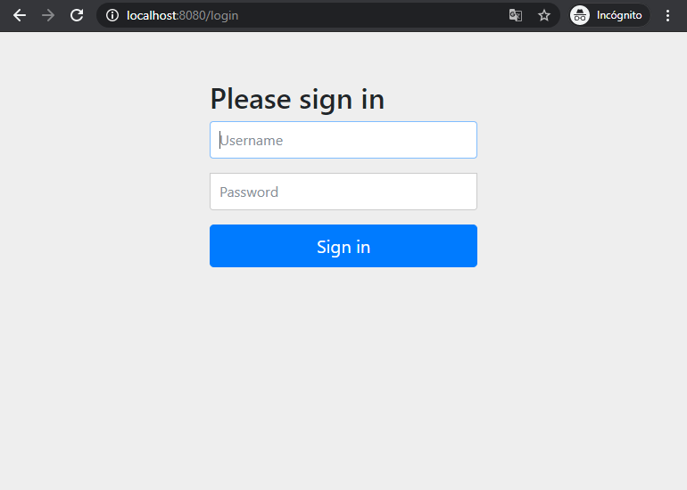
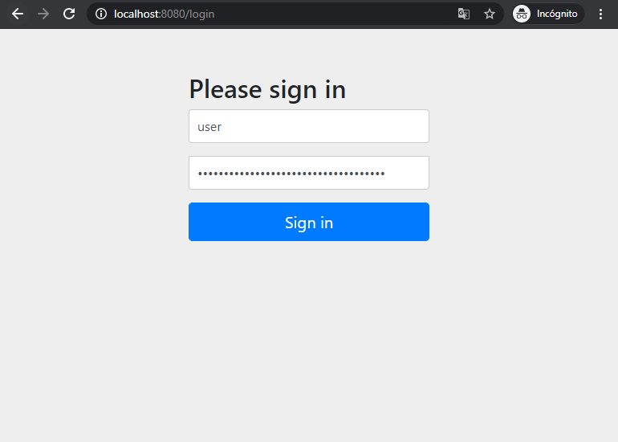

# Ejemplo con formulario de login y SpringBoot
Basándonos en el ejemplo "Ejemplo básico con SpringBoot" se añade una mínima seguridad para el acceso al servicio web, esta capa de seguridad básica constara de un formulario de login basado en usuario password.

Para obtener esta funcionalidad básica con una pequeña modificación en el pom.xml se importaran los módulos de seguridad correspondientes:

* spring-boot-starter-security
* spring-security-test para test

En la sección de dependencias del pom se añade 

```XML
<dependency>
   <groupId>org.springframework.boot</groupId>
   <artifactId>spring-boot-starter-security</artifactId>
</dependency>
<dependency>
   <groupId>org.springframework.security</groupId>
   <artifactId>spring-security-test</artifactId>
   <scope>test</scope>
</dependency>
```

Con este pequeño cambio si se arranca el proyecto se puede observar en el arranque que se genera una clave :

```shell script
Using generated security password: 630ef64c-e075-48b5-a59b-066795556e49 
```
En esta ocasión si se accede a la web localhost:8080 donde antes se veía:



Ahora se ofrece un formulario de login, como no hay ningún login utiliza el de spring por defecto ya que se ha dejado la autoconfiguracion de Spring.



Por defecto como no se ha creado ningún usuario Spring crea el usuario user y le asigna la contraseña que se ha mostrado por trazas en el arranque en este caso :630ef64c-e075-48b5-a59b-066795556e49, si se introducen estas credenciales:




Se puede cambiar el usuario y la clave que por defecto usa spring añadiendo las siguientes propiedades al fichero application.properties:
```properties
spring.security.user.name=urjc
spring.security.user.password=2020
```
De esta forma en vez de generarse una contraseña en el arranque para el usuario user se podrá acceder con las credenciales informadas en fichero de propiedades.
si se intentara acceder a la URL http://localhost:8080/hello, spring detecta que no hay ningún usuario identificado y redirecciona al login, esta configuración la hacer por defecto spring con la incorporación de la dependencia "spring-boot-starter-security".
