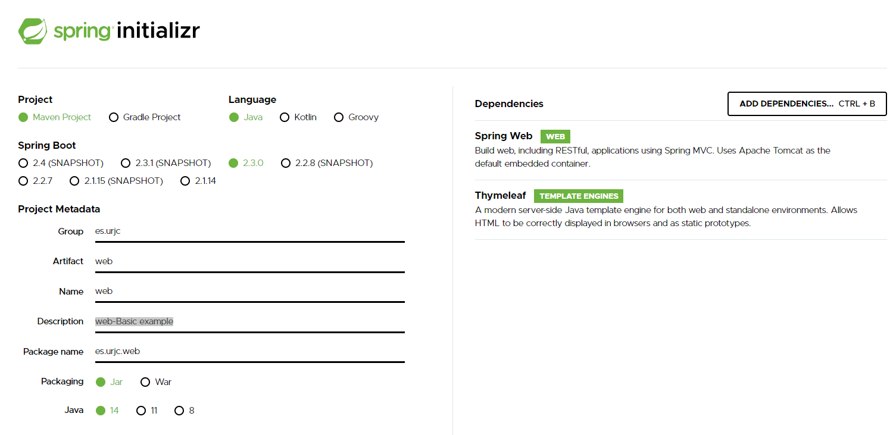
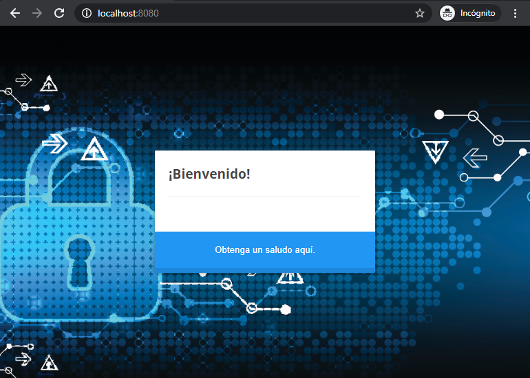
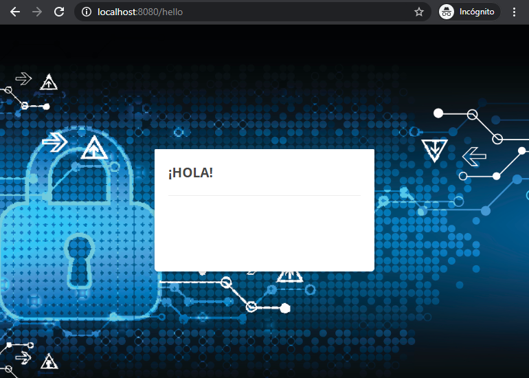

# Ejemplo básico con SpringBoot
Se accede la página del asistente de Spring Boot para la creación de proyectos :
* [Spring initializr](https://start.spring.io/)  


Para este ejemplo básico se seleccionan las siguientes opciones
* Proyecto Maven
* Lenguaje Java
* La última versión estable de Spring Boot
* Empaquetado en JAR
* Ultima versión de Java
* Como módulos de Spring se utilizarán:
  * Spring Web
  * Thymeleaf 
    


Con esta configuración se descarga el proyecto. El contenido es un zip con la siguiente estructura:


Como se puede observar tan solo existen unos pocos ficheros:

* pom.xml : con las dos dependencias indicadas en el web
```xml
<dependency>
    <groupId>org.springframework.boot</groupId>
    <artifactId>spring-boot-starter-thymeleaf</artifactId>
</dependency>
<dependency>
    <groupId>org.springframework.boot</groupId>
    <artifactId>spring-boot-starter-web</artifactId>
</dependency>
```
* WebAplication.java : el starter de Spring Boot básico
```java
@SpringBootApplication
public class WebApplication {

   public static void main(String[] args) {
      SpringApplication.run(WebApplication.class, args);
   }

}
```

Con Maven se puede iniciar el proyecto de la siguiente manera:
```shell script
mvn spring-boot:run
```
Tras la descarga de dependencias se podrá observar el inicio de Spring Boot


El inicio es correcto y como indica el terminal está disponible en la URL http://localhost:8080

Si se accede a dicha url:


Esto es debido a que no hay ningún contenido dentro de la aplicación, no existe ninguna página, para solventar esto y apoyándonos en el módulo que se ha puesto como dependencia **Thymeleaf** se crean dos páginas HTML simples:

* hello.html
* index.htlm

Para que Spring pueda gestionar el flujo de las pantallas se crea una configuración WebMvcConfigurer:
```java
@Configuration
public class MvcConfig implements WebMvcConfigurer {

    public void addViewControllers(ViewControllerRegistry registry) {
        registry.addViewController("/index").setViewName("index");
        registry.addViewController("/").setViewName("index");
        registry.addViewController("/hello").setViewName("hello");
    }

}
```
Con estos cambios en el proyecto se inicia de nuevo la aplicación con 

```shell script
mvn spring-boot:run
```

Se accede a ala URL anterior http://localhost:8080, como se indica en la configuración que se ha añadido el path "/" debe re cargar el view index, que esto se traduce en que de la paginas HTML que se han creado buscara la página index.html.



el mismo resultado se obtiene si se accede a http://localhost:8080/index
 


Si se pulsa sobre el enlace se navegara a la pantalla de saludo.



Como se ha podido observar no existe ningún control de acceso a los recursos expuestos. Sobre esta aplicación simple se añadirán los diversos controles de seguridad que ofrece Spring Securiy Web