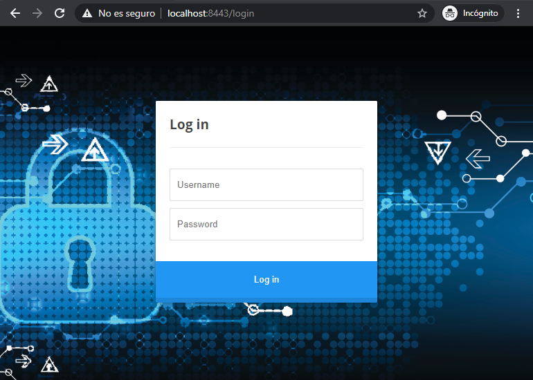
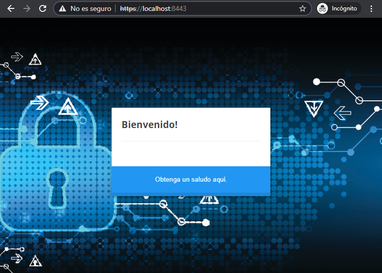
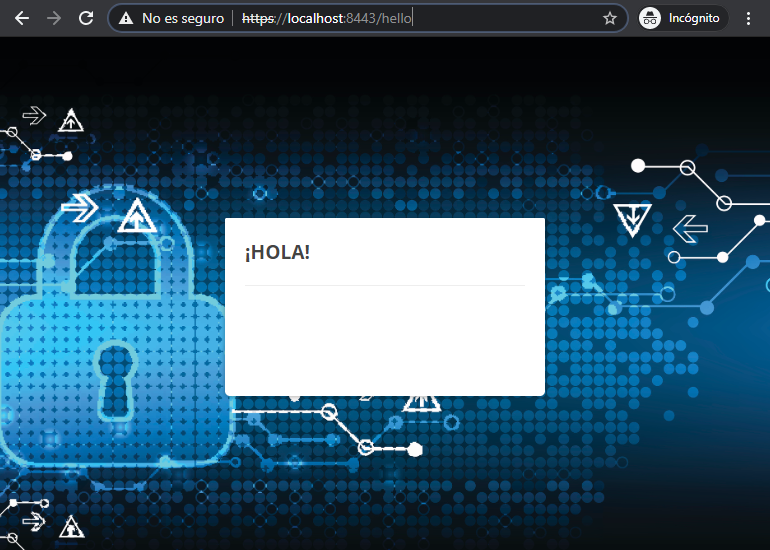

# Ejemplo con formulario de login con SpringBoot usuarios personalizados
Basándonos en el ejemplo "Ejemplo con formulario de login y SpringBoot" se añade una mínima personalizacion sobre la gestion de usuarios ademas de configurar el servidor para funcionar en https para evitar atques MITM.

Se elimina la opcion de autonfigurado de seguridad que por defecto viene con el moduflo de seguridad para ello se puede hacer uso del aplication.properties o bien por anotaciones, en este caso se hara de esta ultima forma. Se añade la siguiente excepcion a la clase WebApplication.java.

```java
@SpringBootApplication(exclude = {SecurityAutoConfiguration.class})
```
Sdicionamelmente se crea una nueva clase de configuracion

```java
@Configuration
@EnableWebSecurity
public class BasicConfiguration extends WebSecurityConfigurerAdapter{}
```
En dicha clase se pueden configurar los usuarios con acceso, la password y los roles que tendran dentro de la aplicaion de la siguiente forma:

```java
auth.inMemoryAuthentication()
                .withUser("user").password(encoder.encode("password")).roles("USER");
```
Se añade un usuarui con nombre user, y contraseña password que tendrá el rol USER.

Con esta configuracion cuando se inicio spring no creara una contrasaña si no que se basara en esta clase para verificar el acceso.

Para añadir una capa de seguridad se activa el protocolo https. Es necaraio un certificado, en este caso se usara un certificado autofirmado
La clave que se usa es urjc-spring
```shell script
keytool -genkeypair -alias urjc -keyalg RSA -keysize 4096 -storetype PKCS12 -keystore urjc.p12 -validity 3650
Enter keystore password:
Re-enter new password:
What is your first and last name?
  [Unknown]:  URJC
What is the name of your organizational unit?
  [Unknown]:  URJC
What is the name of your organization?
  [Unknown]:  URJC
What is the name of your City or Locality?
  [Unknown]:  Madrid
What is the name of your State or Province?
  [Unknown]:  Madrid
What is the two-letter country code for this unit?
  [Unknown]:  ES
Is CN=URJC, OU=URJC, O=URJC, L=Madrid, ST=Madrid, C=ES correct?
  [no]:  yes

Generating 4.096 bit RSA key pair and self-signed certificate (SHA384withRSA) with a validity of 3.650 days
        for: CN=URJC, OU=URJC, O=URJC, L=Madrid, ST=Madrid, C=ES
```
Se puede verificar el contenido del certificado p12 con el siguiente comando
```shell script
keytool -list -v -storetype pkcs12 -keystore urjc.p12
Enter keystore password:
Keystore type: PKCS12
Keystore provider: SUN

Your keystore contains 1 entry

Alias name: urjc
Creation date: 14 jun. 2020
Entry type: PrivateKeyEntry
Certificate chain length: 1
Certificate[1]:
Owner: CN=URJC, OU=URJC, O=URJC, L=Madrid, ST=Madrid, C=ES
Issuer: CN=URJC, OU=URJC, O=URJC, L=Madrid, ST=Madrid, C=ES
Serial number: c6638c454ac81bc3
Valid from: Sun Jun 14 20:07:39 CEST 2020 until: Wed Jun 12 20:07:39 CEST 2030
Certificate fingerprints:
         SHA1: D6:90:5B:A4:B0:44:0C:EA:83:A3:32:A2:0D:EA:B8:7D:FC:1E:EB:23
         SHA256: A6:32:6B:94:46:00:70:7D:4A:6C:A8:34:AC:EB:5A:92:CE:69:D8:B9:F4:03:9D:0C:2C:16:8B:9D:99:DA:3F:79
Signature algorithm name: SHA384withRSA
Subject Public Key Algorithm: 4096-bit RSA key
Version: 3

Extensions:

#1: ObjectId: 2.5.29.14 Criticality=false
SubjectKeyIdentifier [
KeyIdentifier [
0000: D3 27 81 6F 97 B7 C6 5D   45 2D CF E3 FA 7B 2F 37  .'.o...]E-..../7
0010: 23 00 45 9B                                        #.E.
]
]


*******************************************
*******************************************
```
se añaden las siguientes propiedades al application.properties

````properties
server.port=8443

server.ssl.key-store-type=PKCS12
server.ssl.key-store=classpath:urjc.p12
server.ssl.key-store-password=urjc-spring
server.ssl.key-alias=urjc

security.require-ssl=true
````
Con esta configuracion cuando se arranca el proyecto se pude ver que el purto que expone spring-boot es el 8443 (**8443 (https)**)

````shell script
  .   ____          _            __ _ _
 /\\ / ___'_ __ _ _(_)_ __  __ _ \ \ \ \
( ( )\___ | '_ | '_| | '_ \/ _` | \ \ \ \
 \\/  ___)| |_)| | | | | || (_| |  ) ) ) )
  '  |____| .__|_| |_|_| |_\__, | / / / /
 =========|_|==============|___/=/_/_/_/
 :: Spring Boot ::        (v2.3.0.RELEASE)

2020-06-14 20:22:08.441  INFO 4752 --- [           main] es.urjc.webcustom.WebApplication         : Starting WebApplication on Lap-n with PID 4752 ()
2020-06-14 20:22:08.445  INFO 4752 --- [           main] es.urjc.webcustom.WebApplication         : No active profile set, falling back to default profiles: default
2020-06-14 20:22:09.562  INFO 4752 --- [           main] o.s.b.w.embedded.tomcat.TomcatWebServer  : Tomcat initialized with port(s): 8443 (https)
2020-06-14 20:22:09.574  INFO 4752 --- [           main] o.apache.catalina.core.StandardService   : Starting service [Tomcat]
2020-06-14 20:22:09.574  INFO 4752 --- [           main] org.apache.catalina.core.StandardEngine  : Starting Servlet engine: [Apache Tomcat/9.0.35]
2020-06-14 20:22:09.707  INFO 4752 --- [           main] o.a.c.c.C.[Tomcat].[localhost].[/]       : Initializing Spring embedded WebApplicationContext
2020-06-14 20:22:09.708  INFO 4752 --- [           main] o.s.web.context.ContextLoader            : Root WebApplicationContext: initialization completed in 1205 ms
2020-06-14 20:22:10.143  INFO 4752 --- [           main] o.s.s.web.DefaultSecurityFilterChain     : Creating filter chain: any request, [org.springframework.security.web.context.request.async.WebAsyncManagerIntegrationFilter@3db972d2, org.springframework.security.web.context.SecurityContextPersistenceFilter@36061cf3, org.springframework.security.web.header.HeaderWriterFilter@15dc339f, org.springframework.security.web.csrf.CsrfFilter@7e2c64, org.springframework.security.web.authentication.logout.LogoutFilter@27df0f3d, org.springframework.security.web.authentication.UsernamePasswordAuthenticationFilter@119c745c, org.springframework.security.web.savedrequest.RequestCacheAwareFilter@20134094, org.springframework.security.web.servletapi.SecurityContextHolderAwareRequestFilter@3e104d4b, org.springframework.security.web.authentication.AnonymousAuthenticationFilter@1debc91c, org.springframework.security.web.session.SessionManagementFilter@34acbc60, org.springframework.security.web.access.ExceptionTranslationFilter@19382338, org.springframework.security.web.access.intercept.FilterSecurityInterceptor@13275d8]
2020-06-14 20:22:10.238  INFO 4752 --- [           main] o.s.s.concurrent.ThreadPoolTaskExecutor  : Initializing ExecutorService 'applicationTaskExecutor'
2020-06-14 20:22:10.312  INFO 4752 --- [           main] o.s.b.a.w.s.WelcomePageHandlerMapping    : Adding welcome page template: index
2020-06-14 20:22:11.183  INFO 4752 --- [           main] o.s.b.w.embedded.tomcat.TomcatWebServer  : Tomcat started on port(s): 8443 (https) with context path ''
2020-06-14 20:22:11.193  INFO 4752 --- [           main] es.urjc.webcustom.WebApplication         : Started WebApplication in 3.181 seconds (JVM running for 3.633)
2020-06-14 20:23:09.160  INFO 4752 --- [extShutdownHook] o.s.s.concurrent.ThreadPoolTaskExecutor  : Shutting down ExecutorService 'applicationTaskExecutor'
[INFO] ------------------------------------------------------------------------
[INFO] BUILD SUCCESS
[INFO] ------------------------------------------------------------------------
[INFO] Total time:  01:05 min
[INFO] Finished at: 2020-06-14T20:23:09+02:00
[INFO] ------------------------------------------------------------------------

````

Si se accede a la url https://localhost:8443 lo primero que se observa es una alerta de que el sitio no es seguro esto es debido al uso de un certificado autofirmado para este caso formativo se aceptara.


Una vez aceptado 

Se rellena el formulario con uno de los usuarios configurados en esta ocasion en la clase BasicConfiguration (admin/admin)

Se observa que durante todo el flujo de navegación se conserva el protocolo https


